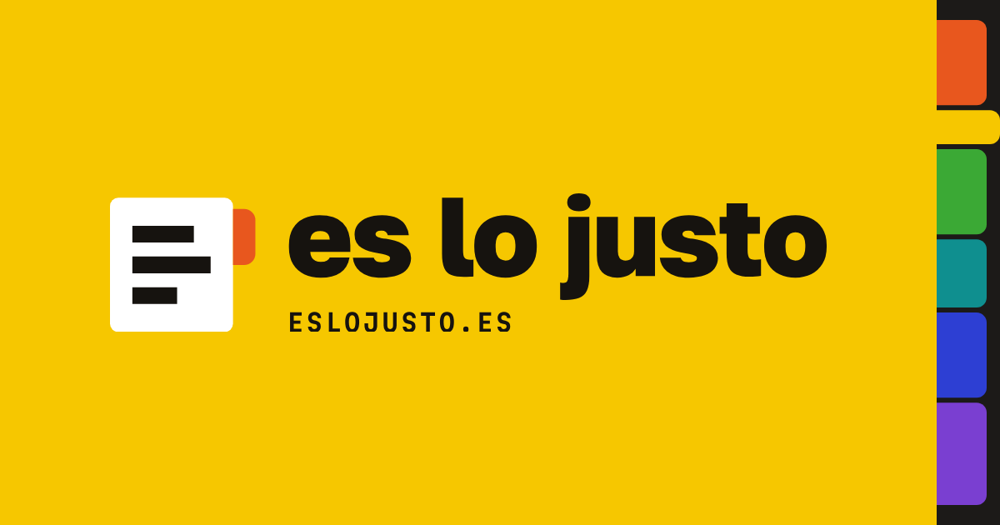

<p align="center">
  <a href="https://eslojusto.es"></a>
</p>

<h3 align="center">Is your final pay fair? Check it against Spanish law, line by line.</h3>

- Enter your dates, your salary and what your final pay (finiquito) says.
- See the legal minimum for each item: salary, holidays, extra pay, severance and notice.
- Get an estimate of your unemployment benefit (paro), with the article behind every figure.

Everything runs in your browser. Nothing you type is sent anywhere.

<h2 align="center"><a href="https://eslojusto.es">eslojusto.es →</a></h2>

It explains the law; it is not legal advice.

## Development

```bash
npm ci
npm run dev        # http://localhost:4321
npm run test:run
```

Analytics (PostHog EU, no cookies) only turn on when the build has `PUBLIC_POSTHOG_KEY`.

## Licence

[MIT](LICENSE)
